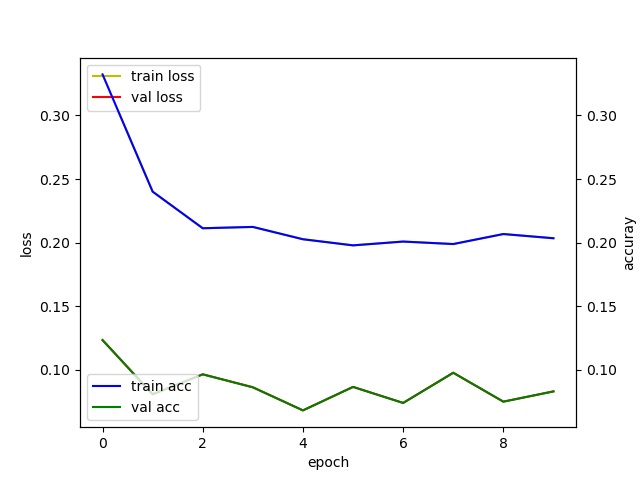
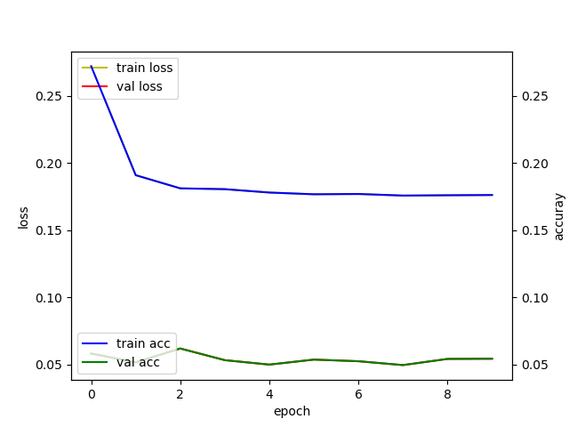
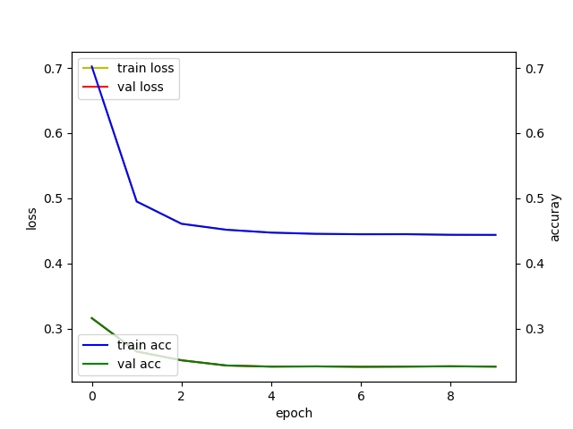
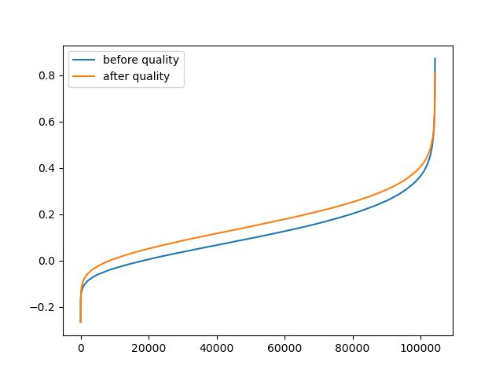
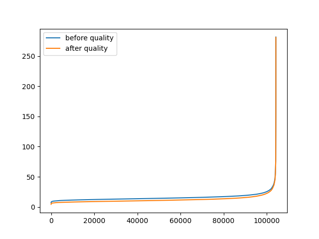

# RNA CITE Concatenate Decoder

RNA CITE seq Concatenate Decoder aggregates RNA-seq and CITE-seq sequences to reproduce CITE seq sequences.
## installlation 
RCCD is a python script and can be downloaded using the following command:

```
git clone https://github.com/racalaga/RCCD.git
```
The following Python packages are required :
```
-scanpy
-tensorflow
```
if use conda env, use conda to install package:
```
conda install -c conda-forge scanpy
conda install -c conda-forge tensorflow
```

## To run the script

The RCCD script uses two csv files, **config.csv** and **match.csv**, for parameter input.

**config.csv**
```
anndata_path,rnacite.h5ad ## input file path
marker_path,match.csv ## match.csv file path
threshold_quality,30 ## Data quality to use for training set
rae_epochs,10 ## epochs used by RNA autoencoders for training
pae_epochs,10 ## epochs used by protien autoencoders for training
gen_epochs,10 ## epochs used by RCCD for training
save_path,produce.h5ad ## output file path
```
**match.csv**

a list of RNA-id and protein-id pairs.
```
CD86,CD86-1
CD274,CD274-1
TNFRSF14,CD270
PVR,CD155
NECTIN2,CD112
CD47,CD47-1
CD48,CD48-1
CD40,CD40-1
CD40LG,CD154
CD52,CD52-1
CD3D,CD3
CD8A,CD8
NCAM1,CD56
CD19,CD19-1
CD33,CD33-1
ITGAX,CD11c
HLA-A,HLA-ABC
...
```
**Run scrpits**
```
python RCCD.py config.csv
```

## input and outputs

input file can be any **anndata** type data <https://anndata.readthedocs.io/en/latest/#>
```
AnnData object with n_obs × n_vars = 104236 × 36776
    var: 'gene_ids', 'feature_types', 'genome'
```

The output file is saved to **save_path** specified in **config.csv**.
```
AnnData object with n_obs × n_vars = 104236 × 28003
    var: 'gene_ids', 'feature_types', 'genome', 'n_counts'
    uns: 'marker_quality_after', 'marker_quality_before', 'original_protein', 'produced_protein', 'protein_marker', 'rna', 'rna_marker'

RCCD save results in anndata.uns :

- marker_quality_before, marker_quality_after : cell by quality metric 
- original_protein : orignal protein counts
- produced_protein : Decoded protein counts
- rna : orignal rna counts
- protein_marker, rna_marker: markers pair definded by match.csv

```

The scrpits provide trainig graph of each model




The scrpits also provide metric score graph as quality 



The trained model saved to **RCCD.h5**

## RCCD2
This script can be run exactly like RCCD.
```
python RCCD2.py config.csv
```
The difference is that RCCD learns only through RNA-CITE seq pairs defined in match.csv and generates CITE-seq data of the same size, whereas RCCD learns from the entire gene and generates data of the same size as CITE-seq data of input data. 
